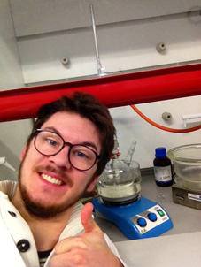

# Werthners Original

## Biography

My name is Quirin Werthner and I am a pharmacist and Ph.D. student at Saarland University. My interests are frighteningly divers and range from mathematical modeling of infectious disease dynamics, population pharmacokinetic analysis (popPK) to literature, politics and whatever peaks my interests.

:man_technologist:

